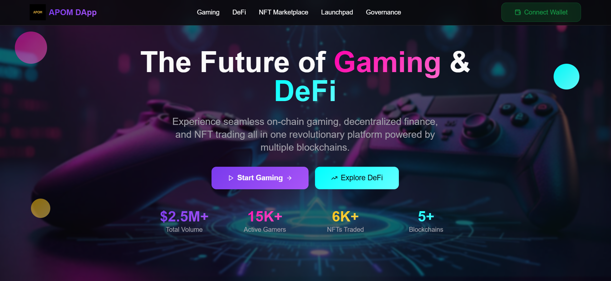

# 🛠️ Decentralized Gaming & DeFi Platform

## 📸 Platform Screenshot

### Home Page - The Future of Gaming & DeFi

*Experience seamless on-chain gaming, decentralized finance, and NFT trading all in one revolutionary platform powered by multiple blockchains.*

---

Welcome! 👋
This guide will walk you through setting up the **Decentralized Gaming & DeFi Platform** on your computer for development or testing.

---

## 📦 Prerequisites

Before setting up the Decentralized Gaming & DeFi Platform, you need to install three tools:

### 1. Node.js (v22)

Node.js allows you to run JavaScript on your computer. Our project requires version **22**.

**Install:**

* Go to the [Node.js download page](https://nodejs.org/).
* Download the **LTS (Long-Term Support) version 22** for your operating system (Windows, macOS, or Linux).
* Run the installer and follow the instructions.

**Verify installation:**
Open your terminal (Command Prompt on Windows, Terminal on macOS/Linux) and run:

```bash
node -v
```

Expected output:

```
v22.x.x
```

> 💡 Node.js automatically installs **npm** (Node Package Manager), so you don’t need to install npm separately.

---

### 2. npm (Node Package Manager)

npm is used to install the extra libraries our project needs.

**Verify installation (already installed with Node.js):**

```bash
npm -v
```

Expected output:

```
10.x.x
```

---

### 3. Git (Version Control)

Git lets you download and manage the project’s source code.

**Install:**

* Go to the [Git official website](https://git-scm.com/downloads).
* Download the correct version for your operating system.
* Run the installer → keep the default settings unless you know otherwise.

**Verify installation:**

```bash
git --version
```

Expected output:

```
git version 2.x.x
```

---

## Getting Started

Follow these steps to set up the project:

1. Clone the repository:

   ```bash
   git clone ...
   ```

2. Navigate to the project directory:

   ```bash
   cd Defi-Hub
   ```

3. Install the dependencies:

   ```bash
   npm install
   ```

4. Start the development server:

   ```bash
   npm run dev
   ```

   The application will now be running on `http://localhost:8080`.

---

✅ That’s it! You now have the **Decentralized Gaming & DeFi Platform** running locally.